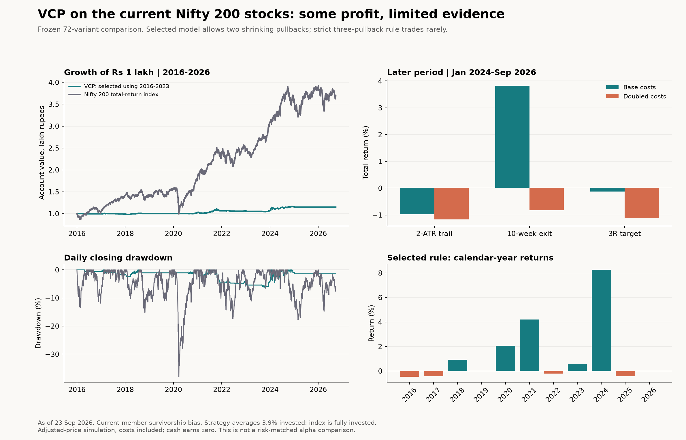
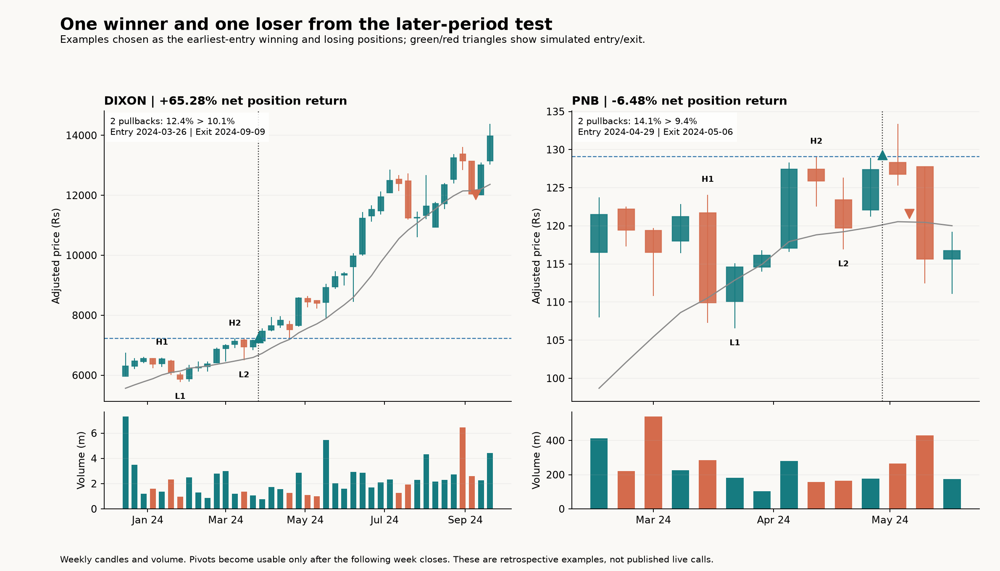

# Minervini-style VCP on the current Nifty 200 universe

Snapshot: **23 September 2026**. Test: **1 January 2016 to 23 September 2026**, with 2014-2015 for warm-up.

**Verdict: some mechanical variants made money after costs, but this study does not establish a reliable or attractive standalone strategy.** The strict three-contraction rule generated too few trades. The more permissive two-contraction version was profitable with a weekly trend exit, but its gains were concentrated, average investment was low, and later results were sensitive to account size and costs.

The rule selected using 2016-2023 data turned **Rs 100,000 into Rs 115,094**: **+15.09% total**, **+1.32% annualized**, **6.19%** closing drawdown. It closed **38 trades**, winning **31.58%**, with net profit factor **2.35**. Average capital invested was only **3.89%**; idle cash earned zero.

Over the same period, the official Nifty 200 total-return index grew **+268.96%** (**+12.94% annualized**). It remained fully invested and had **38.03%** closing drawdown. This is an account-growth comparison, not risk-matched alpha. The index includes gross reinvested dividends but excludes fund costs. [Official index-history source](https://www.niftyindices.com/reports/historical-data).



## Exit comparison

Identical entries: three shrinking weekly pullbacks, or two with any positive reduction; intraday pivot entry; no index gate; no additions. Later period starts flat on 1 January 2024 and ends 23 September 2026. All numbers include costs.

| Version | Full return | Annualized | Drawdown | Trades | Later return | Later, doubled costs |
|---|---:|---:|---:|---:|---:|---:|
| Daily 2-ATR trailing stop | -1.24% | -0.12% | 3.30% | 40 | -0.97% | -1.16% |
| Weekly close below 10-week SMA | +15.09% | +1.32% | 6.19% | 38 | +3.82% | -0.83% |
| Profit target at 3 times initial risk | +2.66% | +0.24% | 4.12% | 39 | -0.12% | -1.11% |

These are total portfolio returns, not the return from putting all capital into every signal. Three exit rules were specified before calculating returns. The profitable weekly exit lets occasional large winners run; the tight daily ATR trail and fixed 3R target performed less well.

## What happened to the strict version?

Keeping the three-contraction requirement, the same intraday/no-index-filter entry produced:

- Daily 2-ATR trailing stop: **-1.47%**, 5 closed trades over the entire test.
- Weekly close below 10-week SMA: **+0.38%**, 5 closed trades over the entire test.
- Profit target at 3 times initial risk: **-0.71%**, 5 closed trades over the entire test.

The two-contraction exception was tested both as at least 70% smaller and as simply smaller. Relaxing that exception is a different implementation; the permissive version must not be presented as proof that the strict rule works. Adding to winners was included in the grid, but **no new higher qualifying VCP add occurred while a position was held**. The add-on/off variants therefore do not provide empirical evidence about pyramiding.

## Selection, later evidence and sensitivity

The 72 combinations cover 3 contraction definitions x 2 entry methods x 3 exits x 2 market gates x 2 add policies. They are correlated variations, not 72 independent discoveries. The criteria and dates are in [plan.json](plan.json). [selection.json](selection.json) was written before later-period simulations. Development: 2016-2020; validation: 2021-2023; later: 2024-September 2026. No rule reached the predeclared minimum of 20 trades and positive returns in each earlier period. The selected rule is an exploratory choice, not a qualified winner. The later years were already used in other repository research, so they are not pristine unseen or prospective evidence.

- Selected rule: earlier total **+2.10%** (12 trades); validation **+5.36%** (18 trades); later **+3.82%** (8 trades).
- Later doubled-cost result at Rs 1 lakh: **-0.83%**. A higher per-share risk prevented the single-share DIXON trade from fitting the 0.5% risk budget. This is a real whole-unit/account-size sensitivity in the model, not only fee drag.
- Rs 10 lakh account, same 0.5% risk rule: later **+6.85%** at base costs and **+5.87%** at doubled costs. Increasing capital changes rounding and fixed-charge effects; this is not extra leverage.
- Restricting bases to 4-8 weeks, without reselecting the model: full **+5.90%** (18 trades); later **+0.42%**.
- Excluding every security with a flagged >40% adjusted daily jump: full **+15.90%**; later **+4.32%**. This is a retrospective source-quality diagnostic, not a deployable filter.
- Later mean net R has a 95% entry-month cluster-bootstrap interval of **-1.00 to 4.68 R**. It includes losses. With only six entry-month clusters, uncertainty is large; this does not correct for trying multiple variants.
- Removing the best later trade's P/L arithmetically leaves **Rs -912**. This is a contribution diagnostic, not a replay with different capital sizing.

Full-run annual returns differ from separately restarted periods because existing positions can cross period boundaries. IRFC was entered in December 2023 and exited in April 2024; it contributes to the continuous full run but is not retroactively inserted into a later-period portfolio that starts flat.



## Exact translation of the image and supplied rules

| Supplied idea | Reproducible implementation |
|---|---|
| Weekly stock selection | Refresh after the last session of a completed Friday-ending week; list usable next session. Incomplete latest week excluded. |
| Price and trend filters | Nominal-price proxy >= Rs 30; adjusted close >=75% of 252-session high and >=2x 252-session low; close > SMA50 > SMA200. SMA200 increases at each of the last 13 weekly observations. |
| High every 4-6 months | At least one fresh 252-session high in each of the last two 26-week blocks, with no high drought longer than 26 weeks. This is an explicit interpretation. |
| Contracting price and time | Weekly pivots confirmed with one week on each side; 3 H-to-L depth reductions, rising lows, non-increasing pullback duration. Two-pullback alternatives disclosed separately. |
| Contracting volume | Final pullback average volume below prior pullback and preceding rally; below prior 10-week volume average; up-week volume exceeds down-week volume over the base. |
| Base duration | 4-26 weeks for the main test; final low no more than 8 weeks old. The image itself depicts a multimonth pattern. Separate 4-8-week sensitivity provided. |
| Daily breakout entry | Either a buy-stop at the known pivot plus 0.1%, or a daily closing breakout with volume >=1.5x prior 50-day average followed by next-open entry. Reject fills >5% above pivot. |
| Stop | Entry minus min(2 x prior daily Wilder ATR20, 10% of entry). Gaps can exceed the stop. No fixed maximum hold. |
| Add to winners | At most one add on a different higher VCP after >=1R unrealized profit, with 0.25% add risk and 0.5% combined planned open risk. No qualifying adds occurred. |
| Post-buy character | Green/red days, tennis-ball behavior and shallow pullbacks are qualitative observations, not fully specified rules. No future-looking post-entry success filter was applied. |
| Earnings and sales in image | Not tested: the repo lacks publication-dated historical earnings/sales data. This is the requested price/volume proxy, not the entire discretionary SEPA system. |

Additional declared execution assumptions: prior average turnover >= Rs 1 crore; start Rs 1 lakh; 0.5% planned risk per stock including costs; maximum five stocks, two per current industry, 20% initial allocation per stock; no borrowing. Rank candidates by final contraction depth, then prior turnover and symbol. Cash and slots are reserved before observing the day's high. Cash from same-day sales is not recycled into earlier entries. Stop and target touched on the same bar takes the stop first. The entry-day low is handled pessimistically where OHLC ordering is ambiguous. Trailing stops only move for the next session. Missing held bars freeze the last mark and are counted. Period-end positions are liquidated with costs.

Cost scenario per side: **0.15% fees/taxes + 0.05% adverse slippage**, plus **Rs 20 per stock exit**. Stress doubles all three and reruns the portfolio. This is a scenario, not reconstructed broker invoices or historical tariffs. NSE lists 0.1% delivery STT on each side and 0.015% buy stamp duty; other charges and slippage motivate the allowance. [NSE statutory charges](https://www.nseindia.com/static/invest/first-time-investor-sebi-turnover-fees-stt-other-levies). Personal income tax is excluded.

## Data audit and limits

All 200 current symbols were loaded, with real IPO start dates and input hashes. Stock histories were downloaded from Yahoo Finance for 2014-2026; a session requires positive volume in at least 100 stocks. **65 invalid rows** were rejected and **252 missing stock-session observations** were recorded. Five Yahoo index gaps were filled from NSE official price records after checking overlapping dates for agreement; 0 missing benchmark sessions remain. Gaps had included special Muhurat/Budget sessions, so leaving them missing would unfairly block index-gated variants for subsequent SMA200 windows. Missing history is not filled with made-up candles.

Large adjusted jumps were flagged in 7 securities. MOTILALOFS has an apparent inconsistent pre-2024 split-adjustment scale; TMPV/VEDL have corporate-action complications. Other large moves may be real. **No simulated trade in the full/later evidence crosses any flagged >40% jump**, but signals may still be affected by vendor quality. The source-quality sensitivity excludes all flagged securities and is reported separately. No selective manual price repair was used to improve returns.

**Historical Nifty 200 membership is not available.** The tested group is today's 200 stocks, including their pre-membership histories; removed, failed or delisted past constituents are absent. NSE monthly archives checked for 2022 and 2026 did not contain full Nifty 200 constituent histories. This survivorship bias prevents a clean claim about the historical index universe. Current industry labels have the same timing limitation.

Adjusted OHLC provides a dividend-adjusted return proxy, not a complete broker cash/dividend ledger. Whole adjusted-price research units can differ from historical legal share counts after corporate actions. Exchange price limits, locked circuits, exact auction liquidity, market impact and earnings-event calendars are not modeled. End-of-day drawdown understates possible intraday drawdown. Twenty-six mechanical regression tests and six actual-history prefix checks validate implementation behavior; they do not validate predictive profitability.

## Evidence and reproduction

- [All 72 variants and periods (CSV)](comparison.csv)
- [Selected strategy trade ledger (CSV)](selected_trades.csv)
- [Selected equity curves and full trades (JSON)](selected_evidence.json)
- [All full/later trades and curves (compressed JSON)](evidence.json.gz)
- [Metrics, benchmark curves and limitations](results.json)
- [Account-size, timing and data-quality sensitivities](sensitivity.json)
- [Per-security data hashes and defects](data_audit.json)
- [Frozen plan](plan.json) and [chronological selection](selection.json)

```text
python scripts/fetch_vcp_data.py
python scripts/fetch_vcp_benchmark.py
python -m unittest discover -s tests -p test_vcp.py -v
python vcp_research.py --phase all
python scripts/vcp_sensitivity.py
python scripts/report_vcp.py
```

Charts additionally require matplotlib (installed locally in `.cache/vcp-plot`). Raw vendor snapshots remain in `.cache/vcp`; fresh downloads may be revised and must be compared with the recorded hashes. No production scanner, daily job, or order system was changed.

**Decision:** retain this as an exploratory price/volume hypothesis. The weekly exit deserves more research than the tight trail or fixed target, but the present evidence is too sparse and biased to call VCP a proven profitable Nifty 200 system. A clean next test needs point-in-time constituents, corporate-action-verified data, explicit earnings filters if reproducing the image, and forward paper trades under frozen rules.
